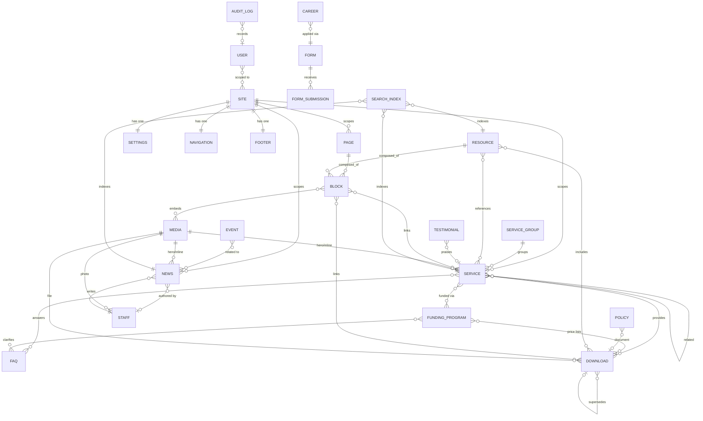

# 13 — Database Architecture

_Physical data architecture beneath the CMS (`12`), realising the content model
(`09`) and traceable to the Blueprint (`08`). Covers engine choice, every
collection→table mapping, relationships (and **why each exists**), indexes, search,
media, caching, scaling, an ERD, and RGHA multi-tenancy readiness._

> **Engine decision (DEC-012, proposed — needs sign-off).** **PostgreSQL** via
> Payload's Drizzle Postgres adapter. Rationale: our model is **reference-heavy with
> hard referential-integrity rules** (`09`/`12` §3) — relational fits far better than
> document storage; Postgres gives native **full-text search** (tsvector/GIN),
> mature **indexing**, **row-level tenancy** for RGHA, transactions for the
> publish/version workflow, and easy **read-replica scaling**. Depends on **D4**
> (managed Postgres vs self-hosted). Ports to MongoDB if required, but we'd lose FK
> integrity and FTS. Not assumed — recorded for approval.

---

## 0. How Payload maps to Postgres (generation pattern)

Payload's Postgres adapter generates tables deterministically. Understanding the
pattern makes the whole schema predictable:

| Model construct         | Generated table(s)                                                                                                |
| ----------------------- | ----------------------------------------------------------------------------------------------------------------- |
| Collection `x`          | `x` (one row per document)                                                                                        |
| Localized fields of `x` | `x_locales` (row per doc × locale: `_locale`, `_parent_id`)                                                       |
| Array/blocks field      | `x_blocks_{block}` (+ `_locales`), ordered by `_order`, linked by `_parent_id`                                    |
| Relationships           | `x_rels` — polymorphic: `parent_id`, `path`, `order`, and one FK column per target (`services_id`, `media_id`, …) |
| Drafts + versions       | `_x_v`, `_x_v_locales`, `_x_v_rels`, `_x_v_blocks_*` (full mirror)                                                |
| Globals                 | single-row table `{global}` (+ `_locales`, `_rels`, `_v`)                                                         |

So every collection below expands to: **base + `_locales` + `_rels` + block tables +
their version mirrors**. We document the _logical_ entity per collection; the
physical tables follow this rule.

---

## 1. Collection → table map

_Key columns shown; localized columns live in `_locales`. `site_id` present on every
content table from day one for RGHA tenancy (§8), defaulting to `gocsa`._

| Collection       | Base table         | Localized (`_locales`)                                   | Block tables                    | Notable columns                                                                                                |
| ---------------- | ------------------ | -------------------------------------------------------- | ------------------------------- | -------------------------------------------------------------------------------------------------------------- |
| Pages            | `pages`            | title, slug, intro, seo*                                 | `pages_blocks_*` (15 blocks)    | `status`, `parent_id`, `site_id`                                                                               |
| Services         | `services`         | name, slug, summary, body, whoFor, cta*                  | (rich body optional blocks)     | `group_id`(FK), `order`, `status`, `site_id`                                                                   |
| Service Groups   | `service_groups`   | name, slug, description                                  | —                               | `order`, `site_id`                                                                                             |
| Funding Programs | `funding_programs` | name, slug, summary, body, eligibility, steps*           | `funding_programs_blocks_steps` | `short_code`, `effective_from`, `site_id`                                                                      |
| FAQs             | `faqs`             | question, answer                                         | —                               | `category`, `is_care_content`, `order`, `site_id`                                                              |
| Policies         | `policies`         | title, slug, summary, body                               | —                               | `category`, `version`, `effective_date`, `review_date`, `site_id`                                              |
| Downloads        | `downloads`        | title, description                                       | —                               | `category`, `file_id`(FK→media), `file_el_id`, `effective_from`, `supersedes_id`, `is_care_content`, `site_id` |
| Resources        | `resources`        | title, slug, excerpt, body                               | `resources_blocks_*`            | `category`, `is_care_content`, `site_id`                                                                       |
| News             | `news`             | title, slug, excerpt, body, tags                         | —                               | `author_id`(FK→staff), `publish_at`, `status`, `site_id`                                                       |
| Events           | `events`           | title, slug, summary, body, location_name                | —                               | `start_at`, `end_at`, `is_online`, `online_url`, `status`, `site_id`                                           |
| Staff            | `staff`            | role, bio                                                | —                               | `name`, `email`, `phone`, `languages`(arr), `order`, `show_on_site`, `site_id`                                 |
| Testimonials     | `testimonials`     | quote, attribution                                       | —                               | `consent_on_file`, `related_service_id`, `order`, `site_id`                                                    |
| Careers          | `careers`          | title, slug, summary, description, salary_info, location | —                               | `employment_type`, `closing_date`, `status`, `application_form_id`, `site_id`                                  |
| Media            | `media`            | alt_text, caption                                        | `media_sizes` (generated crops) | `filename`, `mime`, `filesize`, `width`, `height`, `focal_x/y`, `is_decorative`, `consent_on_file`, `site_id`  |
| Forms            | `forms`            | title, intro, messages, consent_text, fields.label       | `forms_blocks_fields`           | `key`, `routing_inbox`, `routing_greek_inbox`, `site_id`                                                       |
| Form Submissions | `form_submissions` | —                                                        | `form_submissions_values`       | `form_id`, `locale_submitted`, `created_at`, **encrypted PII**, `site_id`                                      |
| Redirects        | `redirects`        | —                                                        | —                               | `from`, `to`, `type`, `active`, `site_id`                                                                      |
| Users            | `users` (auth)     | —                                                        | —                               | `email`, `hash`, `role`, `sites`(arr), audit fields                                                            |
| Search Index     | `search` (plugin)  | title, excerpt, body_text                                | —                               | `doc_type`, `doc_id`, `_locale`, `priority`, `site_id`, `search_vector`(tsvector)                              |
| Audit Logs       | `audit_logs`       | —                                                        | —                               | `actor_id`, `action`, `collection`, `doc_id`, `summary`, `ip`, `created_at`, `site_id`                         |

Globals: `settings`, `navigation`, `footer` (single row **per site** — `site_id`
unique — so RGHA gets its own).

---

## 2. Relationships — and why each exists

_Implemented via FK columns (to-one) or `_rels` tables (hasMany/polymorphic).
On-delete per `12` §3._

| Relationship                             | Cardinality         | Mechanism                         | **Why it exists (business reason)**                                                                                                                                                           |
| ---------------------------------------- | ------------------- | --------------------------------- | --------------------------------------------------------------------------------------------------------------------------------------------------------------------------------------------- |
| Service Group → Services                 | 1‑to‑many           | `services.group_id` FK            | The IA groups services by purpose (`07`/`08` §4); every service must sit in exactly one group for navigation and the menu. Delete-blocked so a group can't vanish under live services.        |
| Service ↔ Funding Program                | many‑to‑many        | `services_rels`                   | A service (e.g. domestic help) is fundable via SAH, CHSP or privately; a funding program covers many services. Families need "how is this paid for?" answered on both sides (journeys J1/J3). |
| Service ↔ FAQ                            | many‑to‑many        | `_rels`                           | FAQs reduce enquiry friction (`08` §5) and attach to the relevant service; an FAQ may apply to several services.                                                                              |
| Service ↔ Download                       | many‑to‑many        | `_rels`                           | Price lists/brochures belong to services and funding; **single source, referenced** (`09` DRY) so one update propagates.                                                                      |
| Service ↔ Service (related)              | many‑to‑many self   | `_rels`                           | Cross-sell/aid discovery ("people also arrange…"); excludes self.                                                                                                                             |
| Funding Program ↔ Download (price lists) | many‑to‑many        | `_rels`                           | SAH/CHSP price lists are the confirmed real content on the current site; must live once and surface on funding + service pages.                                                               |
| Policy → Download (document)             | 1‑to‑1(opt)         | `policies.document_id`            | A policy is often a governed PDF; referencing Media/Download keeps versioning + accessibility in one place. Delete-blocked.                                                                   |
| Download → Download (supersedes)         | 1‑to‑1(opt) self    | `downloads.supersedes_id`         | Price lists change yearly; the chain preserves history and lets the UI mark superseded/expired (`09` §6).                                                                                     |
| News → Staff (author)                    | many‑to‑1(opt)      | `news.author_id`                  | Attribution/trust; author profile links back to their articles (`staff.articles` join). Nullify on delete.                                                                                    |
| Event ↔ News                             | many‑to‑many        | `_rels`                           | Cross-link coverage of community events (`08` §5 engagement).                                                                                                                                 |
| Testimonial → Service                    | many‑to‑1(opt)      | `testimonials.related_service_id` | Place a consented quote on the relevant service page for contextual trust.                                                                                                                    |
| Career → Form                            | many‑to‑1           | `careers.application_form_id`     | Applications flow through a governed, privacy-safe form (`09` §16/§17). Delete-blocked.                                                                                                       |
| Form → Form Submissions                  | 1‑to‑many           | `form_submissions.form_id`        | Submissions are restricted data tied to their form; enables routing + retention (R9).                                                                                                         |
| Any content → Media                      | many‑to‑many        | `_rels` + FK (`file_id`)          | Central Media Library; `media` usage is tracked so deletion is blocked while referenced (`09` §14).                                                                                           |
| Page/Resource → Blocks                   | 1‑to‑many (ordered) | `*_blocks_*` tables               | Flexible, brand-safe page building (`12` §4); order preserved by `_order`.                                                                                                                    |
| User → Site(s)                           | many‑to‑many        | `users.sites`                     | Per-site permission scoping so an RGHA editor can't touch GOCSA content (`08` §10).                                                                                                           |
| Everything → Site                        | many‑to‑1           | `site_id`                         | Multi-tenancy for RGHA on shared infrastructure (§8).                                                                                                                                         |

**Integrity:** FK constraints + `beforeDelete` hooks enforce the block/nullify rules;
`media` usage derived from `_rels` prevents orphaning.

---

## 3. Indexes

| Table                    | Index                                              | Type       | Purpose                                             |
| ------------------------ | -------------------------------------------------- | ---------- | --------------------------------------------------- |
| all base                 | `id`                                               | PK (uuid)  | identity                                            |
| all `_locales`           | `(_parent_id, _locale)`                            | unique     | one row per doc×locale                              |
| slugged collections      | `(site_id, slug, _locale)`                         | **unique** | slug uniqueness per site per locale (`09`/`12` §11) |
| services                 | `group_id`                                         | btree      | menu/group queries                                  |
| services/news/events/etc | `(site_id, status)`                                | btree      | published-only listings                             |
| news                     | `(site_id, status, publish_at DESC)`               | btree      | news feed ordering + scheduling                     |
| events                   | `(site_id, start_at)`                              | btree      | upcoming/past split                                 |
| faqs/downloads/resources | `(site_id, category)`                              | btree      | filtered listings                                   |
| *_rels                   | `(parent_id, path)` + per-target FK                | btree      | relationship resolution both directions             |
| downloads                | `effective_from`, `supersedes_id`                  | btree      | expiry/supersession                                 |
| redirects                | `(site_id, from)`                                  | **unique** | fast 301 lookup, no dup                             |
| careers                  | `(site_id, status, closing_date)`                  | btree      | open roles + auto-close job                         |
| form_submissions         | `(form_id, created_at)`                            | btree      | retrieval + retention purge                         |
| audit_logs               | `(created_at)`, `(collection, doc_id)`, `actor_id` | btree      | governance queries; time-partition key (§8)         |
| search                   | `search_vector`                                    | **GIN**    | full-text (§4)                                      |
| search                   | `(site_id, doc_type, _locale)`                     | btree      | scoped/localized search                             |
| versions `_x_v`          | `(parent_id, updated_at)`                          | btree      | history/restore, retention pruning                  |

Ordering (`order` columns) indexed where used for editor-defined sequencing.
Composite indexes always lead with `site_id` so tenancy filters are index-covered.

---

## 4. Search

- **Primary: Postgres full-text.** A `search` collection/table (populated by
  `afterChange`/`afterDelete` hooks) stores a **per-locale `tsvector`** built from
  title + summary/excerpt + stripped body + category, weighted (title > summary >
  body), with a **GIN index**. Queries use `to_tsquery` with the locale's
  configuration (`english`; Greek via `simple`/unaccent + custom dictionary since
  Postgres has no built-in Greek stemmer — documented so EL search is real, not broken).
- **Scope:** only published, indexable rows (`status`, `noindex`, `show_in_search`),
  filtered by `site_id` and `_locale`.
- **Why not rely on the ORM `LIKE`:** FTS gives ranking, stemming, and speed at scale;
  `LIKE '%q%'` can't be indexed usefully.
- **Future (Enterprise, `08` §5):** add **pgvector** column for semantic/AI search on
  the same table — the index abstraction means the content model doesn't change. If
  volume ever demands, swap to a dedicated engine (OpenSearch/Typesense) fed by the
  same hooks.

---

## 5. Media

- **DB stores metadata only** (`media`, `media_sizes`): filename, mime, size,
  dimensions, focal point, localized alt/caption, `is_decorative`, `consent_on_file`,
  `site_id`, and generated-size rows. **Binaries live in object storage** (S3-compatible),
  not the DB — keeps the DB small and fast.
- **Storage adapter** depends on **D4** (managed bucket vs self-host); abstracted so
  it's config-only. GOCSA owns the bucket.
- **Usage tracking:** `media` references resolved from all `_rels` → `usage_refs`;
  **delete blocked while referenced** (`09` §14). Publish gates (alt required, consent
  for people) enforced at the app layer (`12` §9) and mirrored by NOT-NULL/validation.
- **Delivery:** served via CDN with long cache + content-hash filenames; responsive
  AVIF/WebP variants. DB never in the image hot path.

---

## 6. Caching

Layered, with **event-driven invalidation** (no stale care/price content):

| Layer           | What                                                               | Invalidation                                                                                                                                                                            |
| --------------- | ------------------------------------------------------------------ | --------------------------------------------------------------------------------------------------------------------------------------------------------------------------------------- |
| **CDN / edge**  | Rendered pages (SSR/ISR), static assets, images                    | `afterChange`/`afterDelete` hooks trigger **on-demand revalidation** of affected paths (e.g. a Service publish revalidates that service + menu + home). Globals → site-wide revalidate. |
| **Application** | Payload query results, resolved relationships, nav/footer/settings | short TTL + tag-based bust on write; **Redis** recommended for shared cache + sessions/rate-limiting at scale                                                                           |
| **Database**    | Connection pooling; hot read queries                               | **PgBouncer** pooling; optional **materialized views** for heavy aggregate listings, refreshed on write                                                                                 |
| **Client**      | HTTP cache headers, immutable hashed assets                        | content-hash filenames; HTML `no-cache`/revalidate                                                                                                                                      |

**Principle:** price lists, funding, and policies must never serve stale — their
publish events force immediate path revalidation. Marketing content can tolerate
slightly longer TTLs. Draft/preview always bypasses cache (`12` §13).

---

## 7. Future scaling

- **Reads:** Postgres **read replicas**; route list/detail reads to replicas, writes to
  primary (Payload supports this at the adapter/proxy level). The app is stateless →
  horizontal scale behind a load balancer.
- **Connections:** PgBouncer (transaction pooling) to survive many app instances.
- **Big/append-only tables:** **time-partition** `audit_logs` and `form_submissions`
  (and version tables) by month; cheap retention purges by dropping partitions
  (`09` retention; R9). Prune old versions per retention policy.
- **Search:** graduate from Postgres FTS → pgvector → dedicated engine only if metrics
  demand; same hook pipeline feeds all.
- **Media/CDN:** object storage + CDN scale independently of the DB.
- **Cost/ops:** managed Postgres (depends D4) with automated backups + PITR;
  infra-as-code so RGHA spins up identically.

---

## 8. RGHA multi-tenancy readiness

**Strategy: single shared database, row-level multi-tenancy via `site_id`** (present
on every content table from day one), with **shared schema + shared component/token
system** (`10` §19) and **per-site globals**.

- **Why row-level, not separate DBs:** GOCSA + RGHA share one design system, one CMS
  codebase, and one ops pipeline (`08` §10). A `site_id` column + scoped access
  (`users.sites`, access functions already filter by site) gives isolation without
  duplicating infrastructure — the cheapest correct path.
- **Isolation guarantees:** every query filters `site_id`; composite indexes lead with
  it; access control denies cross-site reads/writes unless a user is scoped to both.
  Slugs/redirects/search are unique **per site**.
- **Per-site config:** `settings`/`navigation`/`footer` are one row **per site**; RGHA
  gets its own brand tokens via the brand scope (`10` §19) and its own content, reusing
  the same tables and components.
- **Escape hatch:** if RGHA ever needs hard data isolation (e.g. compliance),
  Postgres **schema-per-tenant** or a separate instance is a migration, not a redesign
  — because everything is already tenant-tagged.
- **Result:** launching RGHA is _adding a site row + brand scope + content_, not a
  new build.

---

## 9. Entity Relationship Diagram

_Logical ERD (entities + key relationships). Physical tables expand per §0. `SITE`
and `USER` scoping shown; `_locales`/version mirror tables omitted for clarity._

---

## Traceability & Definition of Done

Every table derives from a `09` object; every relationship has a business reason
(§2) rooted in `08`/`07`; indexes serve real query paths; search, media, caching,
and scaling are specified; the ERD documents the logical model; and `site_id`
tenancy makes RGHA an addition, not a rebuild. An engineer can now provision the
database, generate the schema (Payload→Postgres §0), apply indexes, and wire search,
media, caching, and audit — traceable end-to-end.

## Open items surfaced (config, not shape)

- **DEC-012** (Postgres) + **DEC-011** (Payload) sign-off.
- **D4** hosting → managed Postgres + object-storage bucket choice.
- Retention windows for submissions/audit (confirm exact durations with GOCSA).

## Recommended next step

With content (`09`), CMS (`12`), and database (`13`) all specified, the last
pre-code artefact is the **Phase 2 Engineering Implementation Plan** (repo/monorepo
structure, environment/secrets, build order, CI/CD + accessibility/perf gates, and
the content-migration runbook from gocsacommunitycare.com.au). I recommend that
next — then implementation is near-mechanical.
