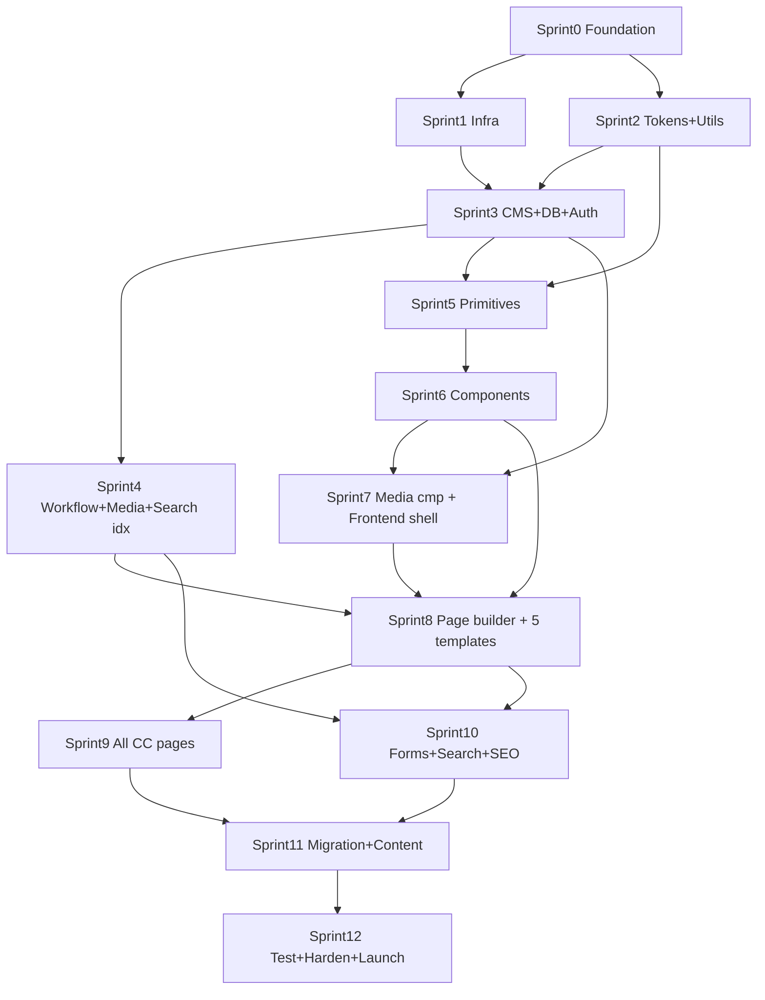

# 20 — Engineering Implementation Plan

_Phase 2 delivery plan. Translates the approved V1 specifications (`00`–`19`) into an
executable roadmap: milestones, sprints, exact repo order, dependency graph, shared
packages, standards, quality gates, deployment, engineering risks, and the master
checklist. No application code here — this governs how code gets written._

> **Ratified stack (DEC-011/012/014/019):** monorepo · **Next.js (App Router, SSR/ISR)**
> front-end · **Payload CMS** (Next-native) · **PostgreSQL** · object storage + CDN ·
> design tokens → component library → CMS → templates. Self-hosted, GOCSA-owned.
> **Complexity is expressed in T-shirt sizes + relative points, not calendar promises**
> — durations depend on team size (to confirm). Sprints assumed 2 weeks.

> **Domain strategy (DEC-020):** production domains (**gocsacommunitycare.com.au**,
> future **www.rgha.com.au**) are **not connected during development** — they are an
> **external deployment dependency**. The build is **domain-agnostic and 100%
> env-driven** (no hardcoded URLs); DNS/SSL/redirects/email-auth happen only at the
> **Production cutover (Sprint 12)**. See §8a.

> **Real-world inputs (sprint-specific, not plan-blocking):** hosting-**provider**
> choice at Sprint 1 (abstracted → config, not code); **real service list** before
> Sprint 8; **D6** vector brand assets before final polish; **D5/D7** + client DNS
> access before launch (Sprint 12).

---

## 1. Development phases (milestones)

| #       | Milestone                 | Delivers                                                                 | Specs realised        |
| ------- | ------------------------- | ------------------------------------------------------------------------ | --------------------- |
| **M0**  | **Foundation**            | Monorepo, tooling, CI skeleton, Engineering Playbook, env/secrets        | `19`, this plan       |
| **M1**  | **Infrastructure**        | Hosting, Postgres, object storage/CDN, environments, IaC                 | `13`, `15`, deploy §8 |
| **M2**  | **Shared Packages**       | tokens, config, types, utils/i18n                                        | `10`, §5              |
| **M3**  | **CMS + Database + Auth** | Payload collections/globals/blocks, DB schema, roles/MFA/sessions, audit | `09`,`12`,`13`,`14`   |
| **M4**  | **Component Library**     | All primitives + `11` components, Storybook, a11y-tested                 | `10`,`11`             |
| **M5**  | **Frontend Foundation**   | Next.js app shell, routing, i18n, layout, nav/footer, SEO framework      | `07`,`11`,`18`        |
| **M6**  | **Page Builder**          | Block rendering + editor blocks, live preview                            | `16`,`12`             |
| **M7**  | **Community Care Pages**  | 5 key templates then full IA, wired to CMS                               | `07`,`08`,`11`        |
| **M8**  | **Forms + Search + SEO**  | Enquiry/careers forms, search, structured data, sitemaps                 | `09`,`15`,`18`        |
| **M9**  | **Migration + Content**   | Crawl, redirects, content entry, bilingual                               | `13`,`18`             |
| **M10** | **Testing & Hardening**   | Full suite green, a11y audit, pen test, perf                             | `19`                  |
| **M11** | **Deployment & Launch**   | Staging→prod, monitoring, runbook, go-live                               | §8, `19`              |

RGHA-readiness is validated continuously (multi-tenant `site_id`, brand-scoped tokens),
not a separate milestone.

---

## 2. Sprint planning

_Each sprint: Objectives · Deliverables · Dependencies · DoD · Testing · Documentation ·
Complexity. DoD always includes the standing gates (§7). Order is strict where noted._

### Sprint 0 — Foundation & standards _(M0)_ — **Complexity: M**

- **Objectives:** stand up the monorepo, tooling, CI skeleton, and the Engineering Playbook.
- **Deliverables:** pnpm + Turborepo workspace; `packages/config` (eslint, prettier,
  tsconfig, tailwind preset); base CI (lint/type/test/build); `docs/engineering-playbook.md`;
  branch/PR/commit conventions; `.env.example` + secrets policy.
- **Dependencies:** none.
- **DoD:** CI runs green on an empty app; playbook merged; a dev can clone→install→build.
- **Testing:** CI self-test; lint/type gates active.
- **Docs:** Engineering Playbook; repo README/contributing.
- —

### Sprint 1 — Infrastructure & environments _(M1)_ — **Complexity: L**

- **Objectives:** provision hosting, Postgres, object storage/CDN; wire environments +
  secrets; implement the **typed env-config loader** (§8a) — **no production domains connected.**
- **Deliverables:** dev/preview/staging/prod environments (on platform-provided URLs, not
  client domains); managed Postgres; S3 bucket + CDN; secrets store; IaC/config; deploy
  pipeline (build→preview); DB migration tooling; env schema validated at boot.
- **Dependencies:** Sprint 0. _(hosting-provider choice confirmed here; domains deferred to Sprint 12.)_
- **DoD:** a hello-world Next app deploys through the full pipeline to staging **on a
  platform/preview URL**; DB reachable; secrets injected; **all URLs read from env**;
  boot fails fast if a required env var is missing; staging is `noindex`+auth (`18`).
- **Testing:** pipeline smoke; connectivity checks; backup/restore dry-run; env-validation test.
- **Docs:** infra/runbook, environment matrix (§8a), secrets policy.
- —

### Sprint 2 — Design tokens package _(M2)_ — **Complexity: M**

- **Objectives:** implement `10` as `packages/tokens`.
- **Deliverables:** tokens as source-of-truth (JSON/TS) → CSS custom properties + Tailwind
  preset + TS types; brand-scoped (`[data-brand]`); dark-mode scaffold; a token preview page.
- **Dependencies:** Sprint 0.
- **DoD:** every `10` token consumable; contrast values verified in an automated test.
- **Testing:** unit test asserting token values + WCAG contrast pairs (`10` §1); visual token sheet.
- **Docs:** token usage guide (in playbook).
- —

### Sprint 3 — Data, CMS collections & auth _(M3, part 1)_ — **Complexity: XL**

- **Objectives:** Payload + Postgres up; collections/globals/blocks from `09`/`12`; roles + auth.
- **Deliverables:** all 18 collections + 3 globals; relationships + on-delete; localization
  (en/el); versions/drafts; **role×site access functions** (`14`); MFA + sessions + password
  policy; audit-log collection; media collection config.
- **Dependencies:** Sprints 1–2.
- **DoD:** admin login works; a Service can be drafted; access matrix enforced; migrations reproducible.
- **Testing:** access-matrix tests (100% cells, §7 security); schema/migration tests;
  localization + versioning tests (`19` §5).
- **Docs:** CMS build notes; generated types published to `packages/types`.
- —

### Sprint 4 — CMS workflow, media pipeline & scheduling _(M3, part 2)_ — **Complexity: L**

- **Objectives:** publishing lanes, media processing, preview, scheduling, search index.
- **Deliverables:** 3 publishing lanes + guards; media responsive pipeline (AVIF/WebP,
  focal crop, alt/consent gates, `17`); live/draft preview; scheduled publish/unpublish
  jobs; search index sync (`13` §4); redirects collection.
- **Dependencies:** Sprint 3.
- **DoD:** editor can publish per lane; images generate variants + block on missing alt;
  preview renders drafts; scheduled job fires.
- **Testing:** workflow/lane tests, media-gate rejection tests, scheduling tests.
- **Docs:** editor workflow notes.
- —

### Sprint 5 — Component primitives _(M4, part 1)_ — **Complexity: L**

- **Objectives:** build `11` §0.5 primitives on tokens.
- **Deliverables:** Button, Link, Icon (coded set), Image, Heading, RichText, Input/Textarea/
  Select/Checkbox/Radio, Tag, Breadcrumb, LanguageToggle, Pagination; Storybook.
- **Dependencies:** Sprint 2 (tokens); Sprint 3 (types).
- **DoD:** each primitive: variants/states, keyboard/ARIA, axe 0, story, tests.
- **Testing:** component + axe per story; visual regression baseline.
- **Docs:** Storybook = living component docs.
- —

### Sprint 6 — Content & layout components _(M4, part 2)_ — **Complexity: XL**

- **Objectives:** the `11` page components.
- **Deliverables:** Hero, Cards, Split, Statistics, Timeline, Accordion, FAQ, CTA, Downloads,
  Testimonials, Contact, Feature Cards, Section, Columns, Spacer.
- **Dependencies:** Sprint 5.
- **DoD:** per component: variants/states/responsive/motion (reduced-motion)/axe 0/tests/story.
- **Testing:** component + axe + visual regression; keyboard patterns (accordion/menu).
- **Docs:** Storybook updated.
- —

### Sprint 7 — Media components & frontend shell _(M4/M5)_ — **Complexity: L**

- **Objectives:** Gallery/Video/LogoStrip; Next.js app shell + i18n routing + Nav/Footer + SEO framework.
- **Deliverables:** Gallery (lightbox), Video (captions/transcript), LogoStrip; App Router
  layout; locale routing (`/`, `/el`); Navigation/Footer/MegaMenu wired to globals; SEO/OG/
  JSON-LD/sitemap/robots framework (`18`); skip-link, landmarks.
- **Dependencies:** Sprints 3, 6.
- **DoD:** localized shell renders from CMS globals; SEO tags + sitemap generate; a11y landmarks pass.
- **Testing:** E2E shell nav (EN/EL), SEO snapshot tests, Lighthouse baseline on shell.
- **Docs:** frontend architecture notes.
- —

### Sprint 8 — Page builder + key templates _(M6/M7, part 1)_ — **Complexity: XL** _(needs real service list)_

- **Objectives:** block rendering + the 5 key templates.
- **Deliverables:** `Section[]`→component renderer; per-collection block allowlists; editor
  block UX + live preview (`16`); templates: **Home, Support at Home, Service, How to Get
  Started, Contact**.
- **Dependencies:** Sprints 4, 6, 7; real service list.
- **DoD:** an editor builds a page from blocks; 5 templates render from CMS in EN/EL; Lighthouse ≥ targets.
- **Testing:** E2E build-a-page + the 5 templates; a11y per template (manual + axe); Lighthouse gates.
- **Docs:** page-builder editor guide (for staff, plain language).
- —

### Sprint 9 — Remaining Community Care pages _(M7, part 2)_ — **Complexity: L**

- **Objectives:** complete the IA (`07`).
- **Deliverables:** Services menu + all service pages, funding pages, About suite, Community/
  News/Events, Careers, Policies, system pages (404/search/privacy/accessibility statement).
- **Dependencies:** Sprint 8.
- **DoD:** every IA page renders from CMS, EN/EL, a11y-passing, on budget.
- **Testing:** E2E journeys J1–J6; template a11y; visual regression.
- **Docs:** IA-to-implementation map.
- —

### Sprint 10 — Forms, search & SEO completion _(M8)_ — **Complexity: L**

- **Objectives:** forms, on-site search, structured-data completion.
- **Deliverables:** Enquiry + Careers forms (validation, consent, anti-spam, **language
  routing**, privacy-safe storage `09`/`15`); search UI over the index; all schema.org types;
  hreflang; breadcrumb schema; analytics + Search Console.
- **Dependencies:** Sprints 4, 8.
- **DoD:** enquiry submits + routes (Greek→Greek inbox), stored safely, no PII in URL/logs;
  search returns localized results; rich-results validate.
- **Testing:** form validation/security/E2E (J1/J3/J4/J6), search tests, SEO validation, rate-limit tests.
- **Docs:** forms/integration notes; CRM/email routing (pending that decision).
- —

### Sprint 11 — Migration & content load _(M9)_ — **Complexity: L**

- **Objectives:** migrate from gocsacommunitycare.com.au; enter real content.
- **Deliverables:** crawl + URL inventory; 301 redirect map (no chains/blanket-to-home);
  content entry with GOCSA (services/funding/policies/price lists); bilingual content;
  media with alt/consent.
- **Dependencies:** Sprint 9; content + sign-off availability.
- **DoD:** redirects resolve; parity report clean or accepted; **CCM content sign-off** (R1).
- **Testing:** redirect tests, 404 sweep, link check, content QA (EN/EL).
- **Docs:** migration record; redirect map.
- —

### Sprint 12 — Testing, hardening & launch _(M10/M11)_ — **Complexity: L**

- **Objectives:** full-suite green + go-live.
- **Deliverables:** regression green; **independent a11y audit** (WCAG 2.2 AA); **pen test**
  closed; CWV field-verified; monitoring/alerting; staging→prod cutover; rollback tested;
  sitemap submitted; GBP/NAP aligned.
- **Dependencies:** all prior.
- **DoD:** every §7 gate + launch checklist (`19` §10) green with owners/evidence.
- **Testing:** full regression, load test, launch checklist.
- **Docs:** launch runbook; post-launch monitoring plan; handover/editor training.
- —

_Post-launch: iterate (`04` Phase 5); RGHA reuses this foundation (`04` Phase 6)._

---

## 3. Repository implementation order (exact)

Create in this order — later items depend on earlier:

```
1.  /                          package.json (workspace), pnpm-workspace.yaml, turbo.json, .gitignore, .nvmrc
2.  /packages/config/          eslint, prettier, tsconfig.base, tailwind-preset  (Sprint 0)
3.  /.github/workflows/        ci.yml (lint→type→test→build→lighthouse→axe→security)  (Sprint 0)
4.  /docs/engineering-playbook.md                                              (Sprint 0)
5.  /infra/                    IaC, env config, migration tooling               (Sprint 1)
6.  /packages/tokens/          src tokens → css/ts/tailwind outputs             (Sprint 2)
7.  /packages/utils/           i18n, seo, formatting, schema.org helpers        (Sprint 2)
8.  /packages/cms/             payload.config, collections/, globals/, blocks/, access/, hooks/, fields/  (Sprint 3–4)
9.  /packages/types/           generated Payload types (published after Sprint 3)
10. /apps/web/                 Next.js app (hosts front-end + Payload admin)    (Sprint 3 onward)
      /apps/web/app/(payload)/admin       Payload admin route
      /apps/web/app/[locale]/layout.tsx   localized shell                      (Sprint 7)
      /apps/web/app/[locale]/…             routes/templates                     (Sprint 8–9)
      /apps/web/lib/                        payload local api, seo, cache
11. /packages/ui/              primitives/ then components/ + Storybook          (Sprint 5–6)
12. /apps/web/app/api/          custom endpoints (forms, search, revalidate, preview)  (Sprint 10)
13. /packages/ui blocks render + /apps/web block registry                       (Sprint 8)
14. /tests/e2e/                 Playwright journeys                              (Sprint 7+)
```

Within `packages/cms`: create `fields/` (shared groups: seo, cta, link, address) →
`blocks/` → `collections/` → `globals/` → `access/` → `hooks/` → `payload.config`.

---

## 4. Development dependencies (graph)



**Hard rules:** tokens before components; CMS+types before templates; components before
page builder; everything before migration; migration + full suite before launch. No page
is built before its blocks/components exist (prevents one-off drift, `11`).

---

## 5. Shared packages

| Package                 | Responsibility                                                                                                                   | Owner               | Reuse                                                  |
| ----------------------- | -------------------------------------------------------------------------------------------------------------------------------- | ------------------- | ------------------------------------------------------ |
| **`packages/config`**   | Lint/format/tsconfig/tailwind preset                                                                                             | Platform            | every package/app; RGHA                                |
| **`packages/tokens`**   | `10` design tokens → CSS vars/TS/Tailwind; brand-scoped                                                                          | Design-Eng          | `ui`, apps; **RGHA re-themes via brand scope**         |
| **`packages/utils`**    | i18n, SEO/schema.org, formatting, URL/slug, dates                                                                                | Platform            | apps, ui, cms                                          |
| **`packages/types`**    | Generated Payload + shared TS types                                                                                              | CMS owner           | apps, ui, tests                                        |
| **`packages/env`**      | Typed, fail-fast env config (DEC-020) — all URLs/domains/provider selection                                                      | Platform            | every server package/app; RGHA                         |
| **`packages/platform`** | **Provider abstractions (DEC-021):** Storage/Media/Email/Analytics/Search/Cache/Auth/Deployment interfaces + adapters + registry | Platform            | apps, cms; **infra swapped at deploy, no code change** |
| **`packages/cms`**      | Payload config: collections/globals/blocks/access/hooks/fields (`09`/`12`)                                                       | CMS/Backend         | `apps/web`; **RGHA reuses same model, scoped by site** |
| **`packages/ui`**       | Component library (`11`) on tokens; Storybook                                                                                    | Frontend/Design-Eng | apps; **RGHA inherits unchanged**                      |

**Ownership principle:** each package has a named owner accountable for its API,
tests, docs, and semver. **Reuse principle:** apps compose packages; packages never
depend on apps; the RGHA site (future `apps/rgha`) consumes the same packages with a
brand scope + `site_id` — no forking. Changes to shared packages run the full
downstream test + visual-regression suite (prevents cross-site breakage).

---

## 6. Coding standards → Engineering Playbook

Standards live in **`docs/engineering-playbook.md`** (created Sprint 0; the one
implementation-required doc). It governs, at minimum:

- **Language/stack:** TypeScript strict; React Server Components by default, client only
  when needed; Next App Router conventions.
- **Tokens only:** no raw hex/px for themable properties (CI-enforced, `10`/`11`).
- **Accessibility as code:** semantic HTML, ARIA patterns, `:focus-visible`, no
  `outline:none` without replacement; axe in every component test.
- **i18n by construction:** no hardcoded user-facing strings; every text field localized;
  never concatenate translated fragments (`09` §0.2).
- **Data access:** front-end reads via Local API on the server (`15`); access functions
  are the only authority; never bypass.
- **Security:** no secrets in repo; validate/sanitize all input; parameterized queries;
  RichText sanitised; PII never in URLs/logs.
- **Testing:** every feature ships with tests to the coverage targets (`19`); DoD includes tests.
- **Git:** trunk-based with short-lived branches; conventional commits; PRs require green
  CI + review; small, reviewable changes.
- **Docs:** Storybook for components; JSDoc on shared APIs; update the relevant spec/plan
  when reality diverges (specs stay the source of truth).

Every engineer reads the playbook before their first PR. Reviews enforce it.

---

## 7. Quality gates (per sprint — all must pass to close)

| Gate              | Standard (from `19`)                                                                                                      |
| ----------------- | ------------------------------------------------------------------------------------------------------------------------- |
| **Build**         | lint + typecheck + build succeed; 0 errors; no console errors                                                             |
| **Testing**       | unit/integration/component 100% pass; coverage ≥80% (100% access-control/validation/i18n)                                 |
| **Accessibility** | axe 0 serious/critical; keyboard + focus verified; Lighthouse A11y ≥100 on any shipped page; manual SR check per template |
| **Security**      | deps + SAST 0 high/critical; access-matrix tests pass; secrets scan clean                                                 |
| **Performance**   | Lighthouse Perf ≥90; CWV LCP<2.5s/INP<200ms/CLS<0.1; budgets not exceeded                                                 |
| **Documentation** | Storybook/docs updated; playbook honoured; spec/plan updated if diverged; DoD checklist ticked                            |

**Additional at release (Sprint 12):** DAST 0 high, pen test closed, independent a11y
audit signed, CWV field-verified, migration/redirects verified, content sign-off, rollback tested.

---

## 8. Deployment strategy

| Environment     | Purpose                 | Rules                                                                            |
| --------------- | ----------------------- | -------------------------------------------------------------------------------- |
| **Development** | Local + shared dev      | seeded data; fast feedback; not public                                           |
| **Preview**     | Per-PR ephemeral deploy | auto-built on PR; a11y/Lighthouse/E2E run here; `noindex`+auth                   |
| **Staging**     | Pre-prod mirror         | prod-like data; UAT, DAST, pen test, content sign-off; **`noindex`+auth** (`18`) |
| **Production**  | Live                    | protected; deploy only from main after gates; scheduled/low-risk windows         |

- **Pipeline:** PR → CI gates (§7) → preview → merge → staging → **manual approval** → prod.
- **Migrations:** versioned, forward-only, run in a release step; **backup before every prod
  migration**; tested on staging first.
- **Rollback:** immutable builds + instant re-point to last-good deploy; DB rollback via
  backup/PITR (`13`); documented rollback runbook; **rehearsed before launch**. Feature
  flags for risky changes.
- **Monitoring:** uptime + health checks; error tracking (Sentry-class); performance/CWV
  field monitoring; DB + queue metrics; log aggregation; **security alerts** (auth
  anomalies, `14` §5); alerting to on-call. Dashboards for the north-star metric (enquiries).

---

## 8a. Environment configuration & domain strategy (DEC-020)

**Principle:** the platform is **domain-agnostic**. Nothing production-specific is
compiled in; **every URL, domain, credential, and integration target is read from
environment variables**, validated at boot. Changing a domain is a config change, never
a code change. Client production domains are connected **only at the Production cutover**.

**Env-driven configuration (all environments):**

| Concern         | Example var(s)                                                       | Notes                                                           |
| --------------- | -------------------------------------------------------------------- | --------------------------------------------------------------- |
| Environment     | `APP_ENV` (development/preview/staging/production)                   | drives behaviour + indexing (staging `noindex`)                 |
| Brand / tenant  | `NEXT_PUBLIC_BRAND`, `NEXT_PUBLIC_SITE_ID`                           | `gocsa` now; `rgha` later (multi-tenant, `13`/`10`)             |
| Site domain/URL | `NEXT_PUBLIC_SITE_URL`                                               | platform URL in dev/preview/staging; client domain only in prod |
| CMS URL         | `NEXT_PUBLIC_CMS_URL`, `PAYLOAD_PUBLIC_SERVER_URL`                   | admin/API origin                                                |
| API URL         | `NEXT_PUBLIC_API_URL`                                                | REST/GraphQL base                                               |
| Asset/CDN URL   | `NEXT_PUBLIC_ASSET_URL`                                              | object-storage/CDN origin                                       |
| Database        | `DATABASE_URI`                                                       | managed Postgres                                                |
| Object storage  | `S3_ENDPOINT/BUCKET/REGION/KEY/SECRET`                               | provider-abstracted                                             |
| Email           | `EMAIL_FROM`, `EMAIL_DOMAIN`, `ENQUIRY_INBOX`, `ENQUIRY_INBOX_EL`    | routing (J4); domain auth at prod                               |
| Analytics       | `NEXT_PUBLIC_ANALYTICS_ID`, `NEXT_PUBLIC_ANALYTICS_DOMAIN`           | privacy-respecting                                              |
| Secrets         | `PAYLOAD_SECRET`, `PREVIEW_SECRET`, `REVALIDATE_SECRET`, `REDIS_URL` | secrets store, never in repo                                    |

- **Boot validation:** a typed schema (e.g. zod) validates env at startup; **missing/invalid
  vars fail fast** — no silent misconfiguration.
- **No hardcoded URLs:** a lint/CI check flags literal `http(s)://…` in app code (allowlist
  for docs/tests) — hardcoding is a build failure.
- **Per-environment values** live in the secrets store / platform env, not the repo;
  `.env.example` documents every key with safe placeholders.

**Production cutover (Sprint 12, when client grants DNS access):**

1. Receive DNS access from client. 2. Point DNS → production infrastructure.
2. Configure **SSL** (auto-provision + HSTS). 4. Configure **redirects** (301 map, `18`).
3. Configure **email authentication** (SPF/DKIM/DMARC for the email domain).
4. **Verify production** (smoke + CWV + redirect + email deliverability checks).
   Until then, **the repo is production-ready and fully tested on non-production URLs.**

## 9. Engineering risk register

| #   | Risk                                                      | Sev  | Mitigation                                                                                                                                                                                                  |
| --- | --------------------------------------------------------- | ---- | ----------------------------------------------------------------------------------------------------------------------------------------------------------------------------------------------------------- |
| E1  | Hosting **provider** choice / prod cutover coordination   | Med  | D4 resolved (DEC-020): domains are external + env-driven; confirm provider at Sprint 1; adapters abstracted → provider swap is config; DNS/SSL/email-auth rehearsed on staging before the Sprint 12 cutover |
| E2  | **Real service list late** delays templates/content       | Med  | Model is generic; build templates with sample data; content entry (S11) is decoupled                                                                                                                        |
| E3  | **Greek search quality** (no PG Greek stemmer, `13` §4)   | Med  | Custom dictionary/unaccent; test EL search explicitly in Sprint 10                                                                                                                                          |
| E4  | **Payload↔Next version coupling** / upgrade churn         | Med  | Pin versions; upgrade behind tests; isolate CMS config in `packages/cms`                                                                                                                                    |
| E5  | **Accessibility regressions** as UI grows                 | High | axe in CI + visual regression + per-template manual audits; gate every PR                                                                                                                                   |
| E6  | **Migration SEO loss**                                    | High | Redirect map before cutover; crawl+verify; monitor 404s; change-of-address (S11/`18`)                                                                                                                       |
| E7  | **Shared-package change breaks a consumer / future RGHA** | Med  | Semver + downstream test/visual-regression on package changes; owners accountable                                                                                                                           |
| E8  | **Scope creep** (portals/payments/RGHA early)             | Med  | Charter scope; new scope = change request; RGHA is readiness-only                                                                                                                                           |
| E9  | **Content sign-off bottleneck** (CCM availability)        | Med  | Schedule CCM review early; batch content; sign-off is a launch gate not a surprise                                                                                                                          |
| E10 | **Performance drift** from media/motion                   | Med  | CI budgets fail the build; responsive pipeline; perf checked per template                                                                                                                                   |
| E11 | **Bilingual gaps** ship silently                          | Med  | Parity report + EL reviewer in UAT; fallback is visible, not hidden                                                                                                                                         |
| E12 | **Secret/PII mishandling**                                | High | Secrets store + scanning; PII rules in `09`/`15`; access-matrix + security tests                                                                                                                            |

Reviewed each sprint; merges into the master risk register (`03`).

---

## 10. Master implementation checklist

_Every task is trackable, owned, and closeable. Format: `[ ] TASK — owner — evidence/gate`._

**Foundation (S0) — IN PROGRESS**

- [x] Monorepo + workspaces + Turborepo — `package.json`, `pnpm-workspace.yaml`, `turbo.json` _(run `pnpm install` to generate lockfile + verify build)_
- [x] `packages/config` (eslint flat + prettier + tsconfig + tailwind preset) — consumed via root `eslint.config.mjs` / `prettier.config.mjs` / `tsconfig.json`
- [x] CI pipeline skeleton (`​.github/workflows/ci.yml`: format→lint→type→test→build; a11y/lighthouse/security/e2e/visual stubbed to add per surface) — _verify green on first push_
- [x] Engineering Playbook authored — `docs/engineering-playbook.md`
- [x] Secrets policy + comprehensive `.env.example` (all domains/URLs env-driven, DEC-020); `.gitignore` excludes all `.env*`
- [ ] **Team action:** `nvm use && pnpm install` → commit lockfile → confirm CI green (not runnable in the authoring environment)

**Infrastructure (S1) — IN PROGRESS** _(infra-agnostic; DEC-020/021)_

- [x] `packages/env` — typed, fail-fast env schema (zod); provider selection vars
- [x] `packages/platform` — provider **interfaces + placeholder adapters + registry**: Storage, Media, Email, Analytics, Search, Cache, Auth, Deployment (DEC-021)
- [x] Provider-selection env vars in `.env.example` (local/console/noop/memory defaults)
- [ ] `apps/web` boot calls `getEnv()` (fail-fast) + `createProviders()` — wired in Sprint 3
- [ ] Environments dev/preview/staging (platform URLs; **no prod domains**) — evidence: deploy logs
- [ ] Postgres + migration tooling (provider-abstracted) — evidence: migrate up/down
- [ ] Object storage adapter (S3/R2 impl) + CDN — evidence: asset served (deploy-time)
- [ ] Staging `noindex`+auth — gate: robots/header check
- [ ] Backup/restore + rollback rehearsed — evidence: dry-run record
- _Note: real infra provider + Postgres/storage adapters are added at deployment; dev runs on placeholders._

**Shared packages (S2)**

- [x] `packages/tokens` (variables.css + tailwind.ts + index.ts; brand/theme/print scopes, dark, reduced-motion) — contrast test in pass 2
- [x] `packages/ui` primitive library — foundational + **all interactive primitives built** (Radix behind GOCSA API, DEC-023)
- [x] Vitest + Testing-Library + jest-axe + Storybook harness; **119 tests; coverage 99.05/87.94/93.33/99.05% (≥80% gate met)**; story per primitive; axe passing
- [x] **CI gates wired + real** (`.github/workflows/ci.yml`): install · format:check · lint(0 warn) · typecheck · test+coverage+axe · Storybook build. Placeholders removed.
- [x] Visual-regression foundation scaffolded (`docs/22`, DEC-025) — provider/baselines PENDING (R15), CI job commented (not falsely active)
- [x] **Sprint 2 gate PASSED → marked COMPLETE; checkpoint `foundation-ui-v1.0`; R13 closed**
- [ ] `packages/utils` (i18n/seo/format) — gate: unit tests (with CMS wiring, Sprint 3)

**CMS + DB + Auth (S3–4)**

- [ ] 18 collections + 3 globals + relationships + on-delete — gate: schema/integrity tests
- [ ] Localization en/el + parity report — gate: localization tests
- [ ] Versions/drafts + retention — gate: versioning tests
- [ ] Role×site access functions — gate: **100% access-matrix tests**
- [ ] MFA + sessions + password policy + audit log — gate: security/auth tests
- [ ] Publishing lanes + guards — gate: workflow tests
- [ ] Media pipeline + alt/consent gates — gate: media-gate rejection tests
- [ ] Preview + scheduling + search index — gate: preview/schedule/search tests
- [ ] `packages/types` published — evidence: types consumed by apps

**Component library (S5–7)**

- [ ] Primitives (§0.5) — gate: axe 0 + tests + stories
- [ ] Page components (`11`) — gate: axe 0 + visual regression + tests
- [ ] Media components (Gallery/Video/LogoStrip) — gate: captions/transcript/alt enforced

**Frontend + Page builder (S7–8)**

- [ ] App shell + i18n routing + Nav/Footer/MegaMenu — gate: E2E shell EN/EL
- [ ] SEO/OG/JSON-LD/sitemap/robots framework — gate: SEO validation
- [ ] Block renderer + editor blocks + live preview — gate: build-a-page E2E
- [ ] 5 key templates — gate: Lighthouse + a11y per template

**Community Care pages (S9)** _(real service list)_

- [ ] Full IA pages from CMS (EN/EL) — gate: journeys J1–J6 + a11y

**Forms/Search/SEO (S10)**

- [ ] Enquiry + Careers forms (validation/consent/anti-spam/routing/privacy) — gate: form security + E2E
- [ ] On-site search (localized) — gate: search tests incl. EL
- [ ] Structured data + hreflang + breadcrumbs + analytics — gate: rich-results validation

**Migration + content (S11)** _(D5/D6/D7 + content)_

- [ ] Crawl + 301 redirect map — gate: redirect tests + 404 sweep
- [ ] Real content entered (bilingual) — gate: content QA
- [ ] **CCM content sign-off** — gate: R1 sign-off recorded

**Launch (S12)**

- [ ] Full regression green — gate: suite 100%
- [ ] Independent a11y audit (WCAG 2.2 AA) — evidence: signed report
- [ ] Pen test closed — evidence: remediation + retest
- [ ] CWV field-verified + monitoring live — gate: dashboards green
- [ ] Sitemap submitted + GBP/NAP aligned — evidence: Search Console
- [ ] **DNS access received → DNS pointed → SSL + HSTS** — evidence: cert + resolve check (DEC-020)
- [ ] **Email authentication (SPF/DKIM/DMARC)** on email domain — evidence: deliverability test
- [ ] Production domain env vars set + verified — evidence: prod smoke on real domain
- [ ] Rollback tested + launch runbook — evidence: rehearsal record
- [ ] Stakeholder go-live sign-off — evidence: approval

---

## Definition of Done (Phase 2)

The platform is live only when: every sprint's gates (§7) passed; the master checklist is
complete with evidence; the launch checklist (`19` §10) is signed; accessibility, security,
and performance are independently verified; content is signed off (R1); and rollback +
monitoring are proven. RGHA-readiness (multi-tenant, brand-scoped) is demonstrable.

## What I need to start (real-world inputs, by sprint)

- **Before Sprint 1:** **D4** hosting/ownership.
- **Before Sprint 8:** the **real service list**.
- **Before/at Sprint 11:** **D5** compliance contact, **D6** vector brand assets, **D7**
  founding year, **CRM/email** routing target, **corporate directory** (SSO, future).

## Recommended first action

Approve this plan and confirm **D4**. Then **Sprint 0** begins: monorepo, tooling, CI, and
the Engineering Playbook — the only remaining doc, authored as the first implementation
task. From there, code proceeds strictly along §3/§4 with every §7 gate enforced from the
first commit.
